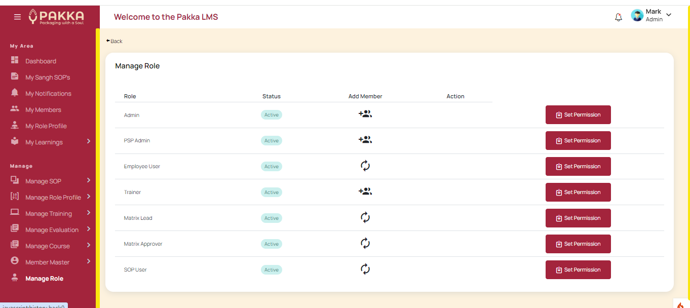

# Admin Module

Master admin - can manage many admin level features.

1. Setting up base permissions and role based access
2. Add/Edit Members

?> 

# Important Notes
Some important notes and points which need to be kept in mind while using the system.
