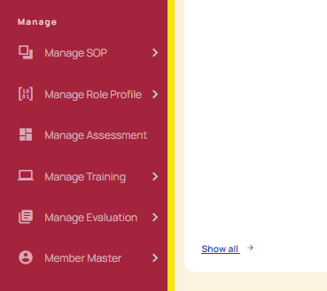
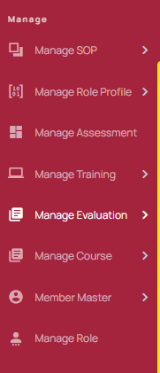
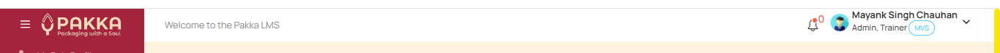
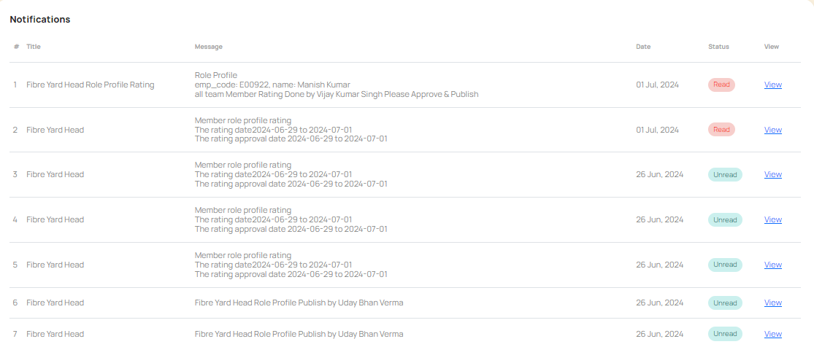
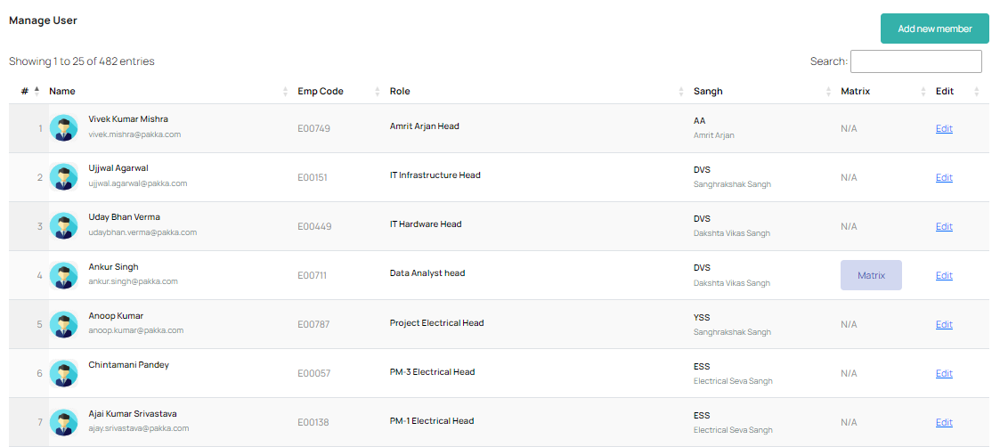
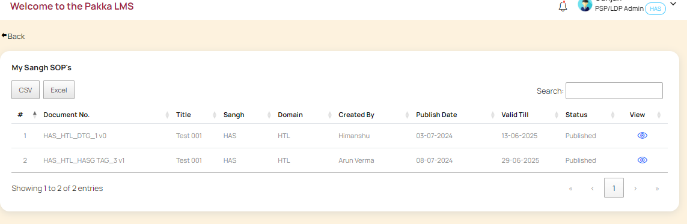
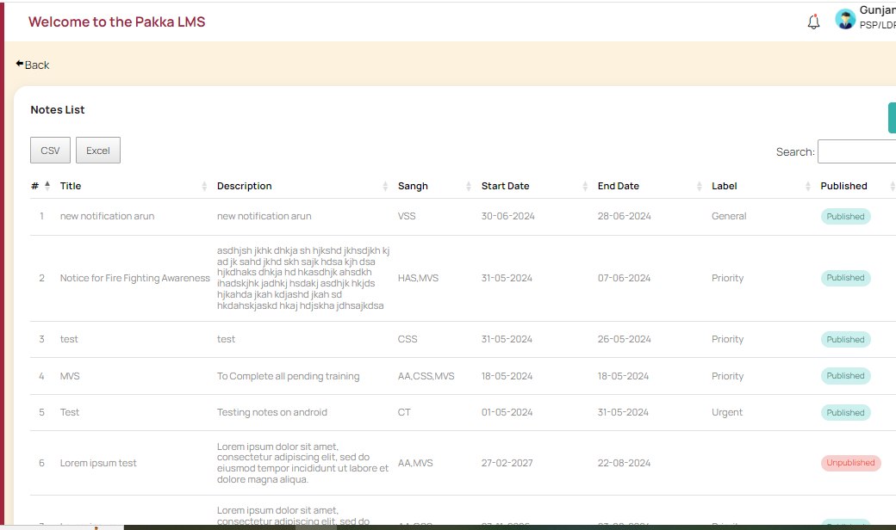
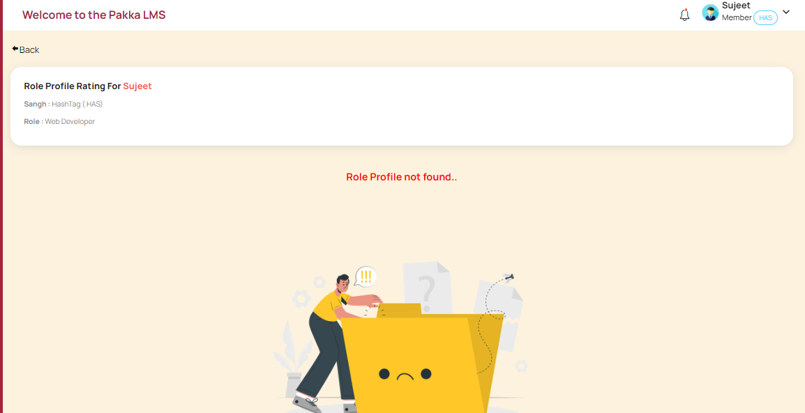
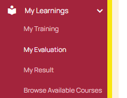
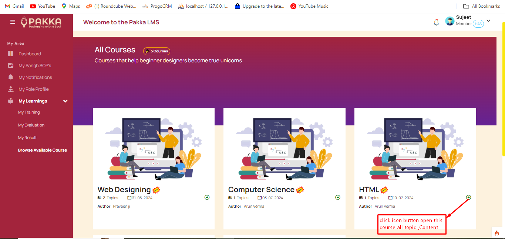

# Modules:

## Member Profile

Member profile shows detailed profile of each member. It shows Name, Email id, Contact Number, Photo attached to the profile along with Role associated. It also shows Team Leader for selected member, its Sangh and Pracharak alongwith contact details.

Role Profile section of member profile shows current, past and future role profiles and available ratings. 

?> 

## Starting & Understanding the navigation

On Pakka's Main web page, any member can login using their existing ID and Passwords on their main dashboard. From there, they may choose the LMS option shown to login inside of LMS application.

### Side Menu's

Side Menu is divided into three main sections

1. My Area - Shows options available for individual members and shows any activity or report meant directly for them.

?> 

2. Manage - Shows options available for TL / Sangh Leaders / Trainers / PSP Admin's who take part in different activities to manage the whole system.

?> 

3. Admin & PSP/LDP Area - This section is given to facilitate admin area access to PSP/LDP and master Admin - who manage settings and main admin activity from here.

?> 

### Top Bar

Profile icon / image is given to help any member access their profile or logout from system.
?> 

### Notification Bell

Notification Bell is given on top bar - which will showcase any new activity where action is required by member. Red dot shows available unread messages. Member can access all messages by clicking on view all.

?> 

### Email Notifications

Email notifications are received on individual member's email id's as and when any action takes place, where their attention is needed.

?> 

## Member's Area

This section covers all menu items meant for Member user.

?> 

1. My Sangh SOPs: Shows SOP's of Sangh that member belongs to.

?> 

2. My Notifications:

?> 

3. My Members:

?> 

4. My Role Profile: Shows Published Role Profile with which Member is associated. If Ratings are available, details will also be shown in the view section of available RP.

?> 

5. My Learnings: My learnings has few submenu's meant for different activities.

?> 

6. My Trainings: Section shows any Trainings assigned to the member.

?> 

7. My Evaluation: Section shows any Evaluation or Assessment exams assigned to the member.

?> 

8. My Results: Section shows Results of Evaluation or Assessment given.

?> 

9. Browse Available Courses: Member can also browse to any courses (for self learning) available on LMS portal across Pakka repository.

?> 
