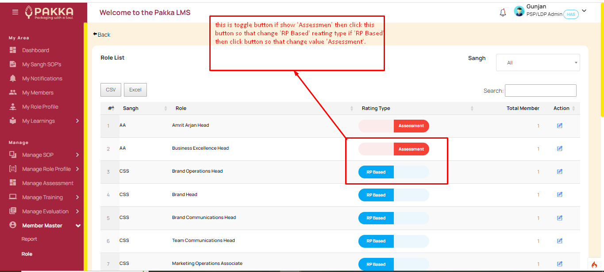
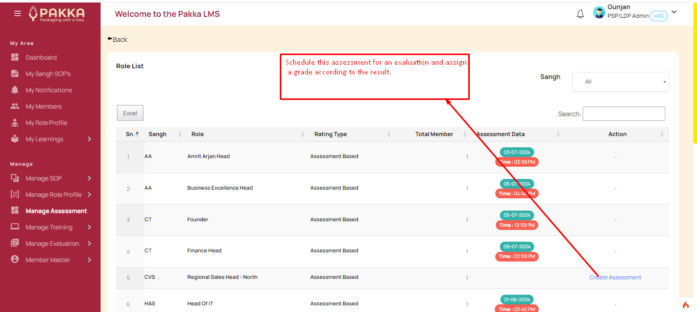
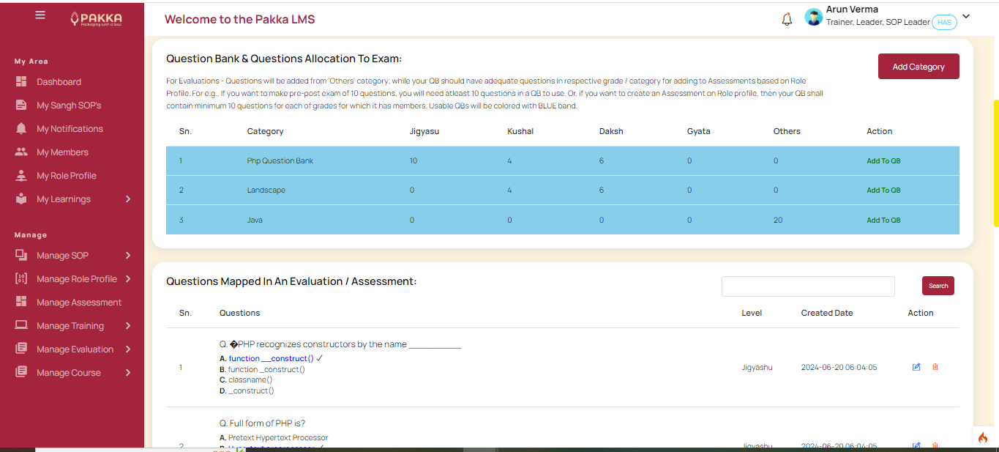
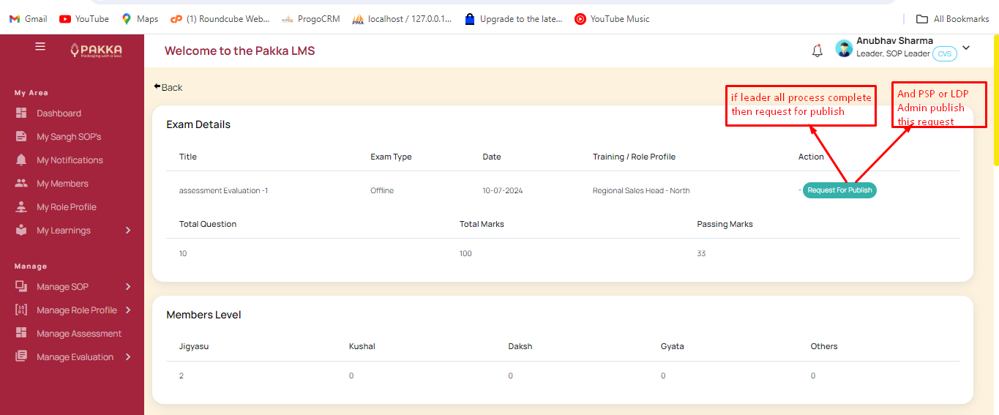
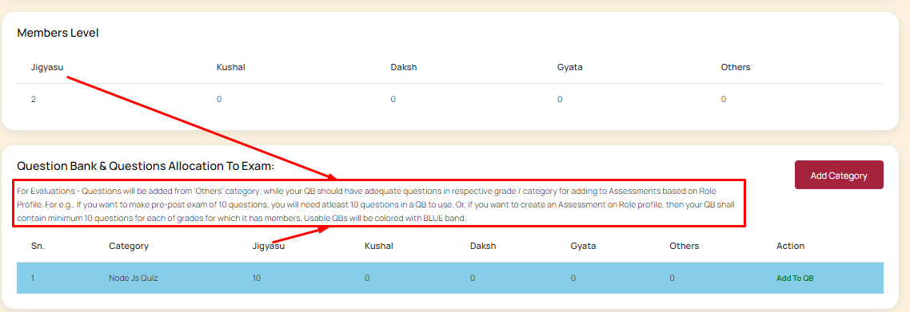

# Assessments

(Applicable only for those for whom Assessment based rating is set by Admin)
When any role is set for Assessment based rating. Then, PSP/LDP Admin may conduct an assessment based rating process for such roles. TLs can view such available profiles in their console. They also get to see current rating level of each such member.

?> 

?> 

- TL has to add QBs, attach questions to it as per need of the assessment.

?> 

- PSP/LDP admin can suitably identify and schedule this assessment for any given RP.
- They will attach Questions from available QB and immediately such assessments can be published for an assessment based review.

?> 

It shall be noted that for Assessment based rating, an existing previous rating must be available, else, system will treat user at base level of Jigyasu.

?> 

On publish of final results of assessments - new ratings are published and automatically attached to member profile.
