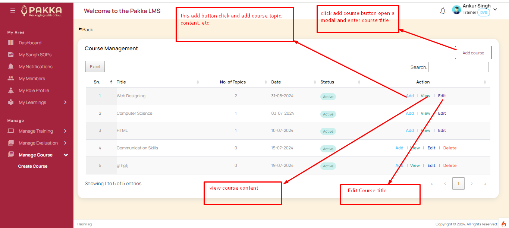
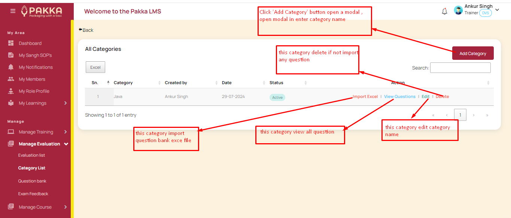
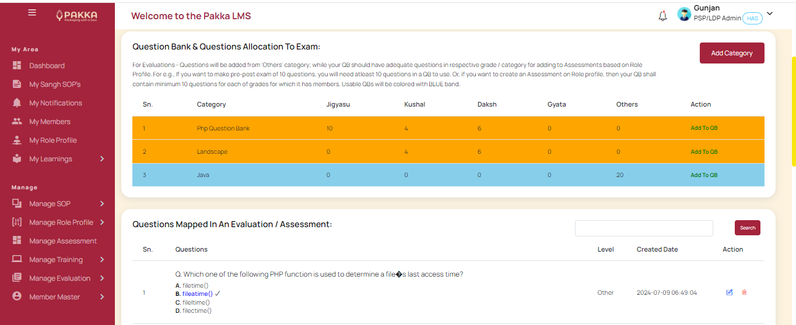

# LMS

LMS module is a Learning Center for this project. Under LMS module, the essential functioanlity revolves around creation of new courses and exams / question banks.
This LMS is integrated with Trainings module - so that each training can be mapped with suitable content and examination.

Similarly, this is also integrated with RP based assessments, where exams can be conducted for ratings.

The LMS constitutes following sub-modules / features -

## Courses

- Course Authoring: Courses can be created by trainers. Courses may have an outline, and can be organized as multiple chapters or a single pager course. Detailed course can be created inside the system with ability to add suitable pdf/ppt/word or mp4 files or video links for easy content sharing with participants.

?> 

## Question Banks:

- Question bank creation: QBs can be created by Trainers on multiple domain/areas/categories - under 5 levels - Jigyasu, Daksh, Kushal, Gyata and Others. QBs can be easily populated by importing MCQs in standard CSV format / from excel. System understands each question text corresponds to 04 choices of answers and one of them is marked as correct answer.

?> 

## Evaluation

- Evaluation / Assessments: Are basically Examination sub-module for this application. Trainers can populate Exams, as per need and for each exam configuration, they can attach suitable number of questions from available or new QBs.

Based on the above, the LMS module provides easy method to attach a course and exam to any training and also align an exam to Role profile based assessment on need basis.

This module also uniquely proide interface to members availing the service - to easily naigate courses to learn on the fly, as per thier needs and also, offers online examinations - where timed exams are conducted and results are freezed automatically. Courses and QBs are resuable and can be mapped for reuse later in any new training / exam.

?> 
