# Role Profile

TL Member is responsible for creating Role Profiles for each Role for whom, s/he is marked as a TL. Each RP is mapped to a Fiscal Year. So, when a TL navigates to this section, and after selecting an approprite FY; they will see list of RPs (created or to be created). Created RPs will have a view button / other action buttons activated. While, when RP is yet to be created - 'Create' will be visible.

RP is created and associated with active Roles available. And on creation, the members under that role will get associated with Role Profile automatically.

?> 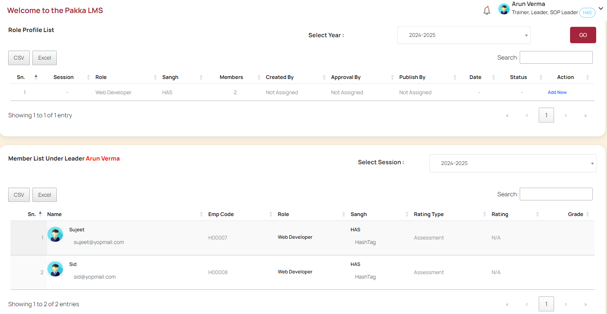

Steps to create a new RP:

1. On clicking create - a popup shows FY and Role for which RP creation is intended. On submit, the screen will guide member to add 'Mission', Objectives 1 to 3 for the selected RP. On submit, the RP will get created in draft mode.

?> 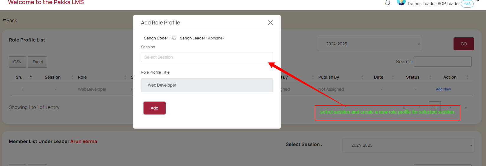

2. Then, member can select 'Add Details' button to add detailed 9x3 matrix to the selected Role Profile.
   2.1. While adding details - member has to input 3 skills under each of 9 KPIs with sub-weightage for each of the skill.
   2.2. Sub total of all 27 skills' sub-weightage shall not be more than 100.
   2.3. Inputing all 27 skills is mandatory.

   ?> 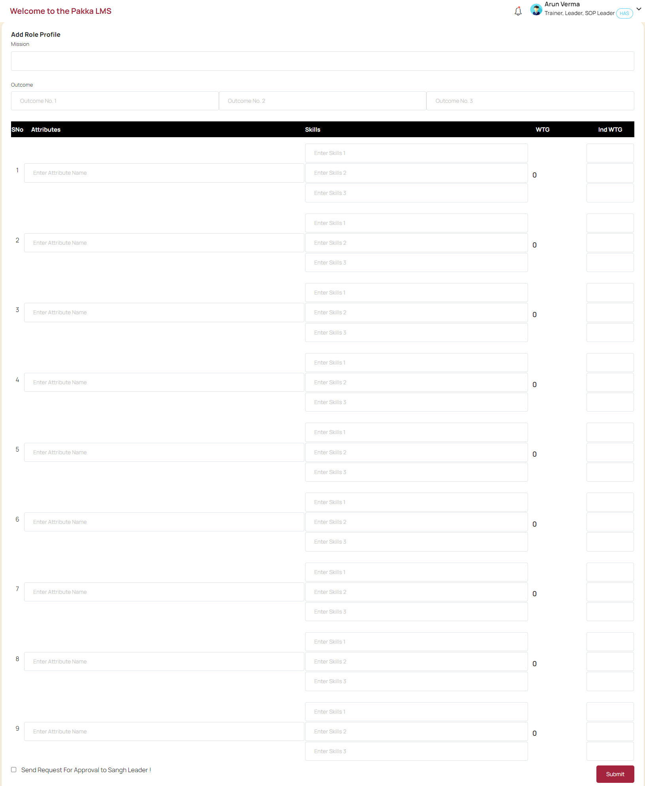

3. After input, member can save and submit the Role Profile.

?> 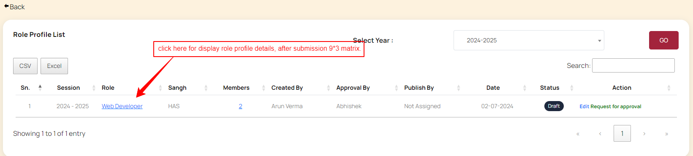

4. After adding details, TL can send this RP to Sangh Leader for approval.

5. Sangh leader reviews the submitted RP from list of RPs available for approval - and may suggest new changes, make suitable modifications (if needed) and send RP to PSP/LDP for final publishing.

?> 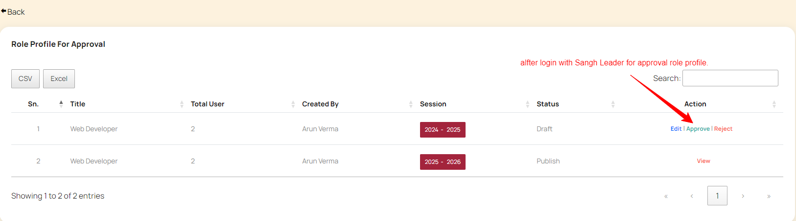

6. PSP/LDP can review and finally publish to make RP available for all members.

?> 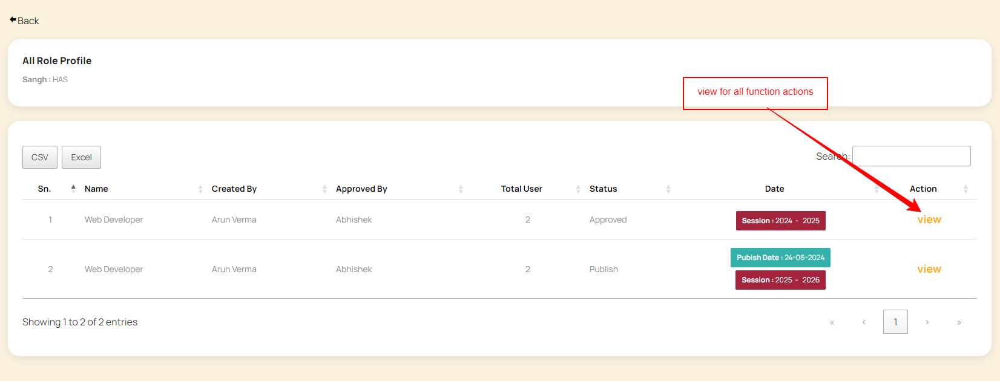

?> 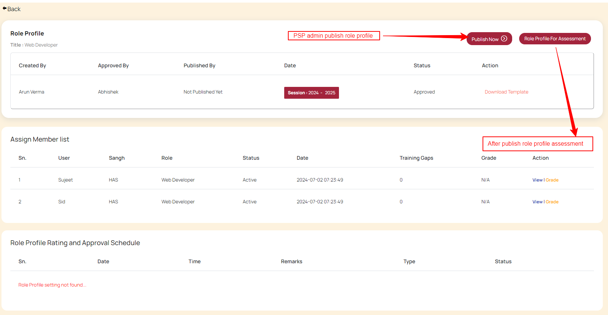

?> 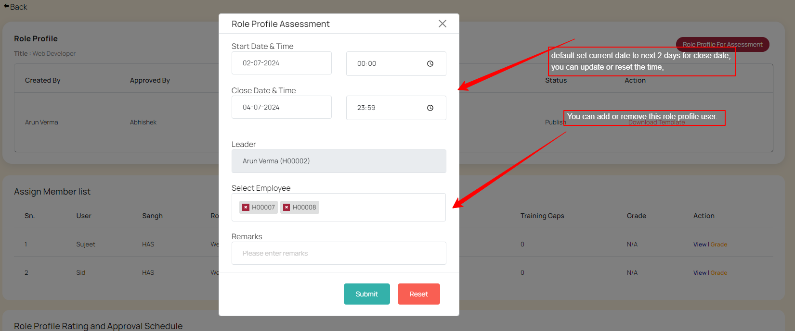

?> 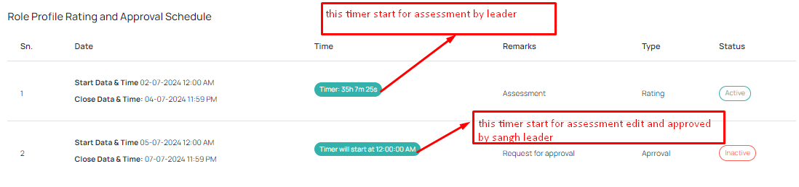

### RP based Ratings process

(Applicable only for those for whom RP based rating is set by Admin)

RP based ratings are induced by PSP/LDP admin's as and when ratings process is decided to take place. PSP/LDP admins invoke and allocate a time duration to each TL to give ratings for each of the member against a RP. When any such time window is made open, RPs will show a 'Rating' button enabled and suitable notification and emails to 
TL and Sangh Leaders.

?> 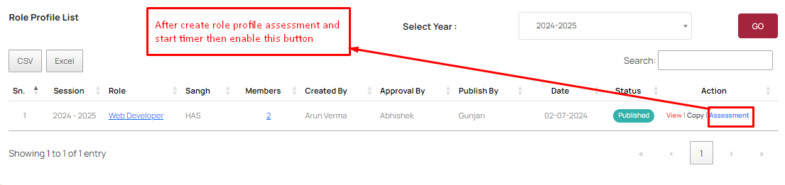

TL's are responsible for ratings while Sangh Leaders approve the ratings. Sangh Leaders have right to modify the ratings given by TLs. So, when Ratings window is available, during the given time period, TL has to give ratings on RP for each member.

?> 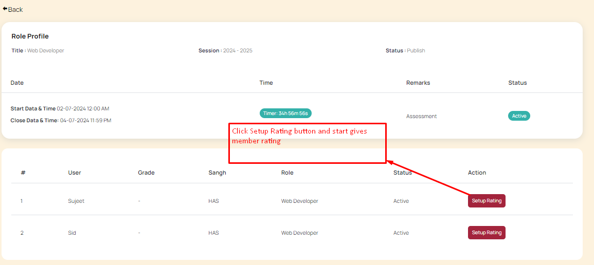

1. TL will be able to view RP of each member, and can give star rating (1 to 4 stars) and also provide GAPs against each skill listed in RP.

?> 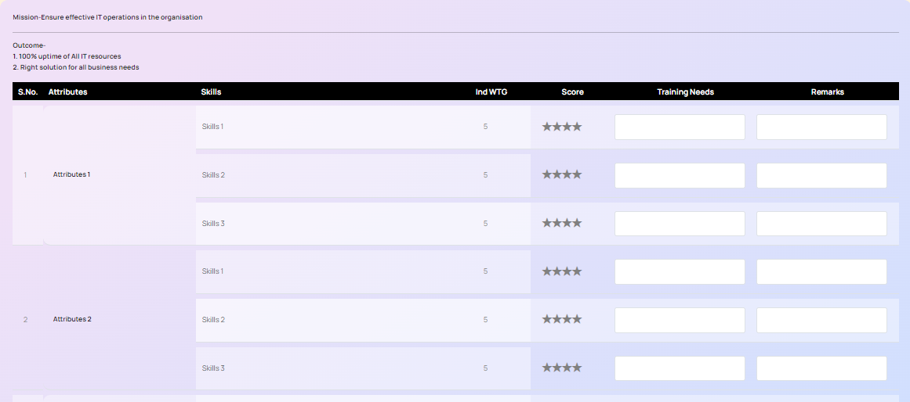

?> 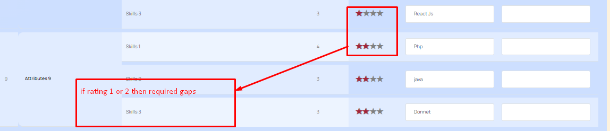

2. On completion, RP gets submitted directly to Sangh Leader for approval. Sangh Leaders get 2 days / 48 hours to review and approve. If they fail to do so in allotted time, PSP/LDP admin may schedule to give more time for such approvals.

?> 

3. PSP/LDP admin's schedule the ratings, if needed. And after Sangh Leader approvals, they can publish the final ratings.
