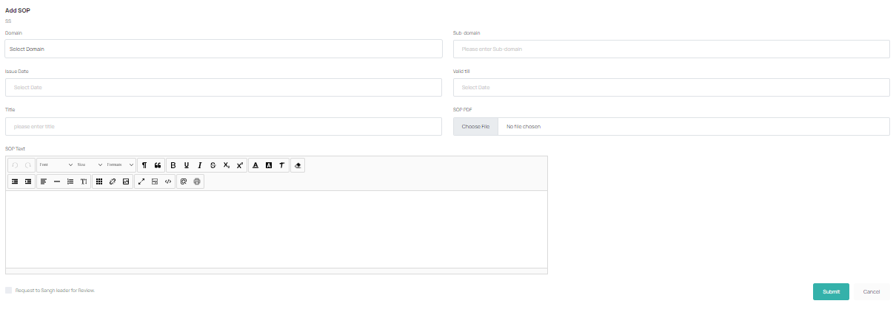
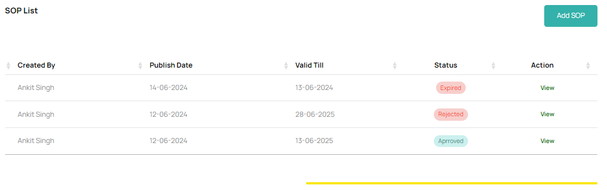
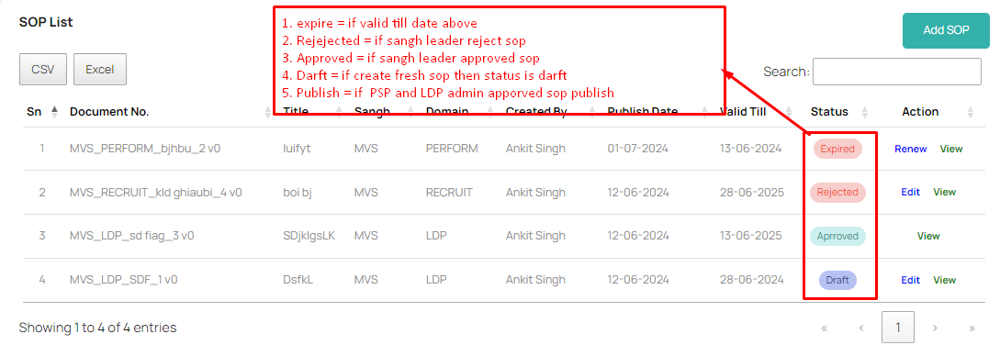
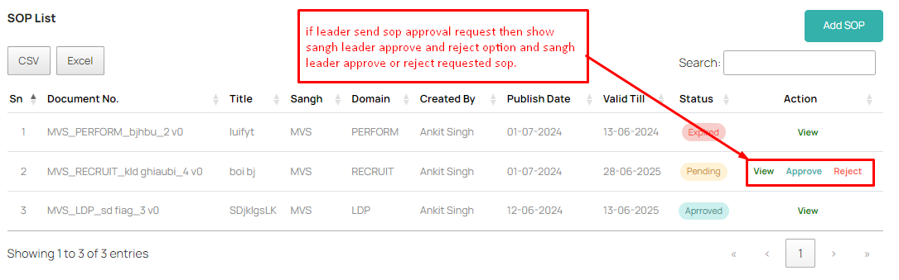

## SOP

SOP stands for Standard Operating Procedures. Pakka industry has many verticals and internal divisions to manage different aspects of its operations. Each member is assigned with a Role and each Team Leader is assigned duty to create SOPs for processes laid out for members and different roles and activities.

Team Leader creates SOPs for their Sangh for various roles / profiles / processes for which they are responsible. Once they create SOPs, these go to Sangh Leaders for approvals. Sangh leader reviews each SOP and if found suitable - approves it and hands over to PSP / LDP department for publishing. In this process - each SOP is assigned with a unique SOP number, version. SOP creation step has two options while creating a new SOP. Team Leader member can opt any one way to create an SOP.

Steps for creating SOP by Team Leader:

1. Select a domain for which SOP is being created and (optionally) add a sub-domain to it.

?> 

2. Each SOP must have an expiry / validity - after which SOP will need to undergo a revision.

?> 

3. While creating SOP, TL chooses a suitable title and adds description and steps / image based flow charts in the given text area.
   Or 4. Alternatively, TL can also upload a PDF document which can act as an SOP by browsing file option.

?> 

4. On submitting, TL can select - 'send to Sangh Leader for approval' - after all edits are done.

?> 

Then, Sangh Leader gets to see this SOP in their listing an they can 'Edit', 'Review' and 'APPROVE' if found suitable. On Approval - the SOP is moved for publishing by PSP/LDP Admin. Else, on rejection - this goes back to the TL member for resubmission.
