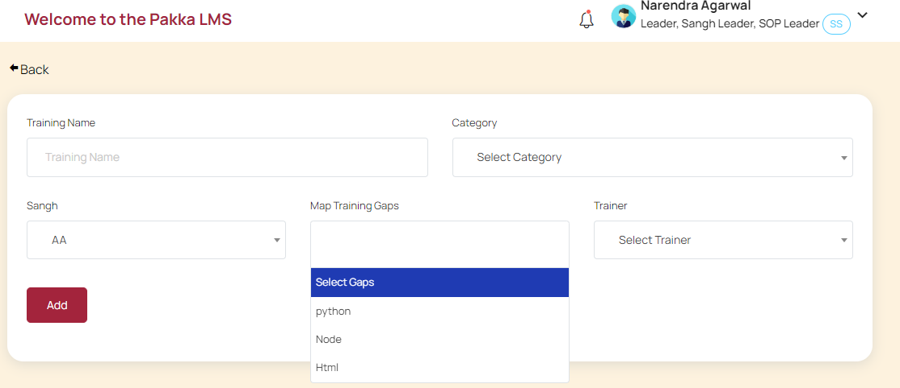
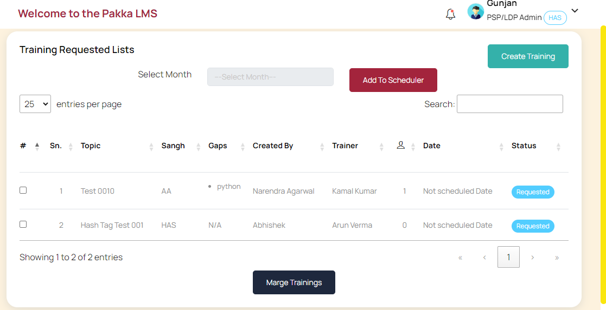
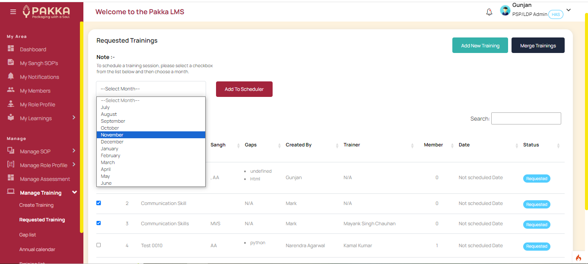
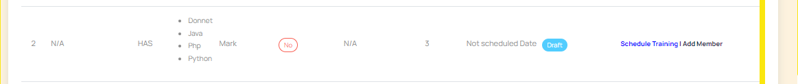
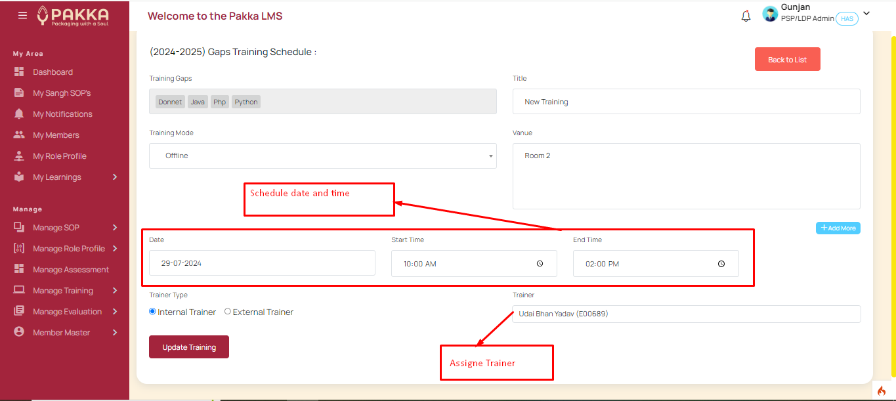
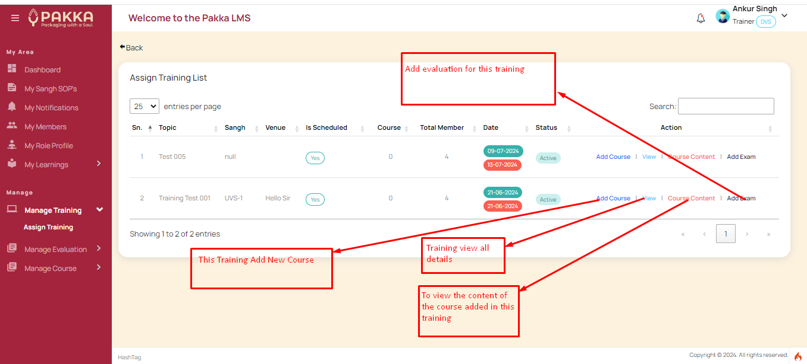
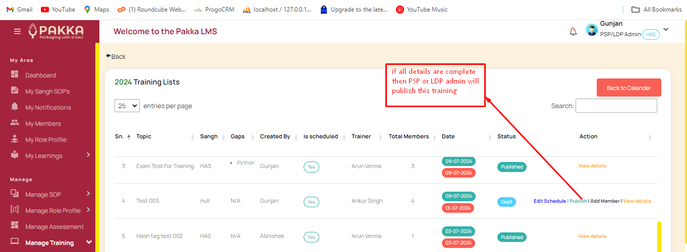
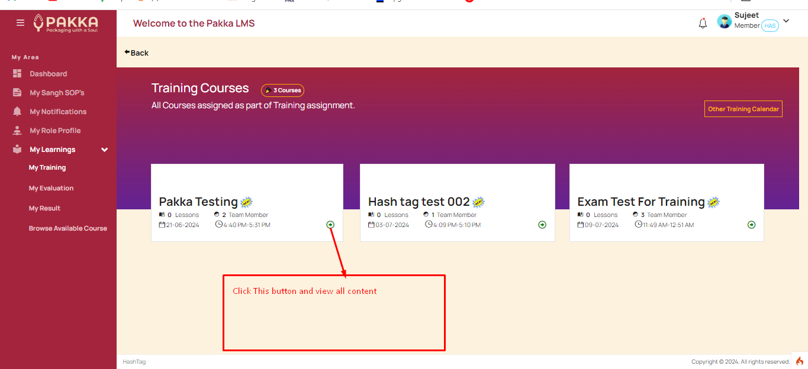
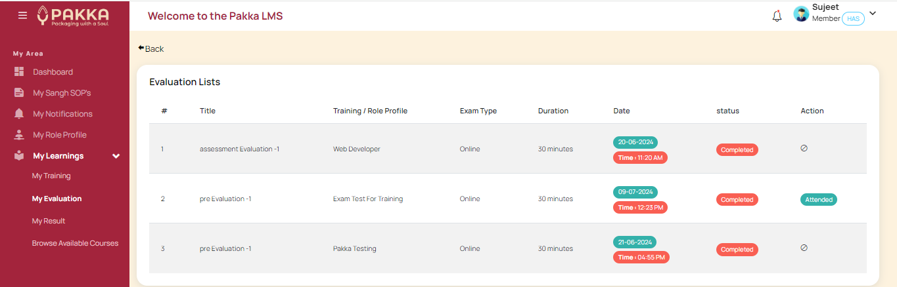
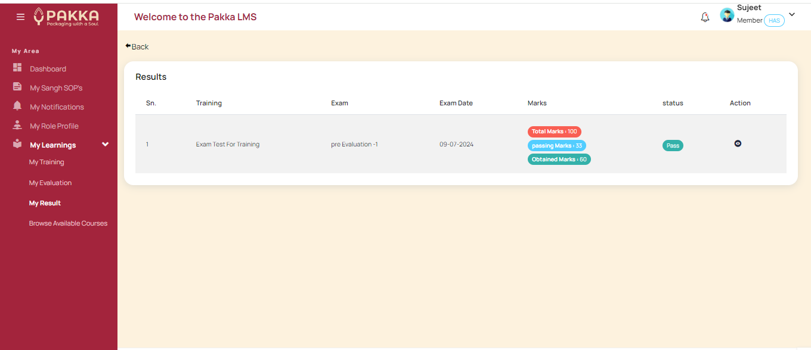

# Trainings

- Sangh Leaders can send Training requisition to PSP Admin, based on available Gap lists.

?> 

- They can choose one or more than one GAPs to be included in a training. They have to assign a Trainer for each such request.

?> 

- PSP/LDP Admin can create Traings based on multiple requisitions from Sangh Leaders.

?> 

- PSP/LDP Admin may also create a training on its own.

?> 

- PSP/LDP Admin chooses number of trainings from requisition list - and can map it to upcoming months to plan up trainings.

?> 

- After aligining, all such trainings will be available in the given month as draft.

?> 

- PSP/LDP Admin - have to align a suitable date/time, location to submit and assign to the Trainers.

?> 

- Trainers have to manage the trainings - create Course for trainings, and manage evaluations. These are discussed seperately in sections below.

?> 

- On completion of Course and evaluation mapping - trainer requests PSP/LDP admin for publishing.

?> 

- After Publish by PSP/LDP admin, the trainings reflect in member's learning area, they can also browse to course details, links, etc. for learning.

?> 

- On date of evaluation, link to evaluation is available in member's learning area - they have to take exam during given time schedule. On successful exam completion, members will be navigated to give feedback.

?> 

- The evaluations are automatically calculated and Trainer may review it. PSP/LDP Admin has right to publish the final results.

?> 
